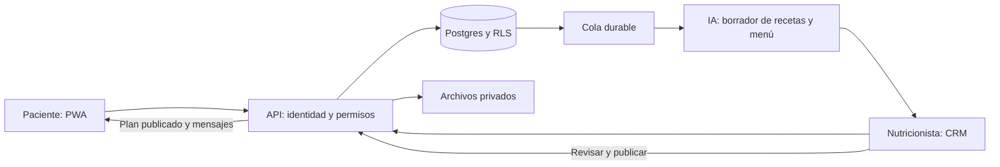

# Plan V: revisión y plan de acción

Fecha: 16 de septiembre de 2026. Estado: **propuesta de desarrollo basada en revisión del repositorio**, no implementación ni aprobación de producción.

**Avance revisado el 17 de septiembre:** [informe de ejecución y verificaciones](revision-avance-2026-09-17.md). Continuación el mismo día: migraciones ejecutables de núcleo e ingreso (esquema vacío), RPC, cola de autoguardado y revisión profesional en ficha. Las tablas de diagnóstico de este documento conservan el punto de partida; el estado por entrega está en el dashboard y en ese informe.

## Decisión recomendada

Conservar la base React + TypeScript + Hono + Supabase y convertirla en un producto persistente por circuitos completos. Primero asegurar identidad, privacidad y datos; después conectar onboarding, archivos, planes, mensajes e IA. El diseño Nutrigo debe pasar del showroom de desarrollo a las rutas autenticadas y al build de producción.

La app tiene una demo extensa y reutilizable, pero todavía no está lista para atender pacientes reales. No corresponde asignarle un porcentaje de avance: una pantalla terminada no equivale a una función persistida, segura y operable.

**Confirmado por el usuario en esta revisión:**

- Primera versión: web instalable en el celular (PWA) y CRM web.
- Fotos de comidas, estudios/análisis y fotos corporales opcionales desde el inicio.
- Nutricionista y paciente conectados, con comunicación humana como diferencial.
- IA dentro del trabajo profesional para proponer menús y recetas que la nutricionista revisa y publica.
- Onboarding profesional, moderno, con animaciones agradables y carga de información útil.
- Uso de Superpowers: instaladas y leídas `using-superpowers`, `brainstorming`, `writing-plans` y `verification-before-completion`, desde [obra/superpowers](https://github.com/obra/superpowers). Se aplicó su método de relevamiento, separación de diseño/ejecución y verificación. El pedido actual autoriza preparar el plan completo; los documentos son propuestas, no decisiones técnicas ya aprobadas.

**Hipótesis de planificación:** piloto con Verónica, pacientes adultos y operación inicial en Argentina; un profesional responsable por paciente. No son restricciones confirmadas por el usuario. Menores, tutores y equipos de profesionales requieren ampliar permisos y consentimiento antes de incluirlos. No bloquean esta planificación.

## Documentos para ejecutar

1. Este documento: diagnóstico, prioridades, dependencias y definición de lanzamiento.
2. [Arquitectura y modelo de datos](superpowers/specs/2026-09-16-plan-v-arquitectura-design.md): módulos, contratos, archivos, privacidad, PWA, operación y pruebas.
3. [Onboarding e IA](superpowers/specs/2026-09-16-plan-v-onboarding-ia-design.md): pantallas, campos, movimiento, revisión clínica y generación de planes.
4. [Primer bloque ejecutable](superpowers/plans/2026-09-16-plan-v-fundaciones.md): correcciones iniciales con archivos, contratos y pruebas concretas.

`docs/pending-work.md` continúa como índice canónico; los IDs `PV-xx` de este plan son la secuencia vigente. `tasks/plan.md` y `tasks/todo.md` conservan el historial de cortes. No se reabren funciones de demo ya completadas: se agrega su condición de salida a producción.

## Qué revisé y qué pude verificar

Repositorio activo: `plan-v/`, Git independiente del directorio padre. Se revisaron entradas frontend, autenticación, store, cliente API, rutas Hono, autorizaciones y serializers, repositorio Supabase, esquemas SQL, IA, onboarding, menús, mensajes, archivos y documentación de backlog. El snapshot de `archive/` se consultó mediante su inventario; no se mezcla con la aplicación activa.

Se contrastó el mapa Nutrigo con el inventario local decodificado: página Interface con **36 frames**, correspondientes a doce superficies en tres tamaños. El archivo `.fig` original y `Documentation.pdf` existen. No se redecodificaron los 325 MB del archivo ni se verificó cada override/componente de Figma. El pack sigue siendo fuente visual y funcional, no evidencia de backend.

Verificación nueva de esta revisión:

| Comprobación | Resultado y alcance |
| --- | --- |
| `npm test` | **73 archivos, 370 pruebas aprobadas**. Incluye unidades, render estático y rutas con memoria/mocks; no demuestra RLS real. |
| `npm run check` | TypeScript cliente y servidor aprobados. `tsconfig.json` excluye código heredado y componentes UI no usados. |
| `npm run build` | Aprobado, **121 módulos**. Emite PatientApp/CrmDashboard legacy; el showroom depende de `import.meta.env.DEV`. |
| Navegador gstack | Onboarding demo abierto a 390×844. Captura inspeccionada en `.scratch/architecture-audit-2026-09-16/onboarding-current.png`. Revisión puntual, no QA visual completa. |
| Prueba sintética del serializer | `toPatientSelfView` conserva un marcador de timeline interno: `patientTimelineContainsMarker: true`. No hubo acceso a pacientes reales. |
| Prueba de resolución de auth | Sin DB, `resolveRequestAuth` devuelve `{ kind: 'demo' }`. No distingue producción. |
| Estado Git | Numerosos cambios y archivos anteriores sin consolidar. Se preservaron; esta revisión no los considera propios ni los da por revisados línea por línea. |

No se ejecutaron migraciones, pruebas RLS contra una instancia real, pagos, envíos de email, despliegues ni llamadas de IA con datos de pacientes. La auditoría npm anterior figura en el backlog, pero no se volvió a ejecutar aquí.

## Estado real por capacidad

| Capacidad | Lo reutilizable hoy | Brecha para terminar |
| --- | --- | --- |
| App paciente / CRM | Diez destinos paciente y once módulos profesionales; componentes Nutrigo y marca Plan V | Habilitar diseño en sesiones reales y build, rutas, guards y QA responsive completa |
| Auth / acceso | Supabase Auth, autorización por relación y pruebas negativas | Invitaciones reales, estados de cuenta, MFA profesional, separación explícita demo/staging/producción |
| Base de datos | Adaptador parcial; contrato 016 v2 documentado | Contrato ampliado ejecutable, RLS probada, migraciones seguras y paridad de escrituras |
| Onboarding | Seis pasos demo, nombre preferido y hábitos opcionales | Historia inicial, consentimientos versionados, archivos, guardado/reanudación y revisión profesional |
| Fotos y estudios | Captura de comida mediante data URL | Storage privado, subida verificada, clasificación, URLs temporales, estudios y evolución corporal |
| Menú / recetas | Editor semanal de títulos y lectura paciente | Recetas estructuradas, ingredientes, porciones, semanas fechadas, versiones y publicación |
| IA | Análisis de comidas y brief profesional | Generación de recetas/menús, jobs, evaluación, costos y fallo explícito sin datos simulados |
| Mensajes | Hilos bidireccionales, inbox y recibos demo | Persistencia de recibos, actualización entre dispositivos, adjuntos y notificaciones reales |
| Agenda / hábitos | Flujos demo, calendario y registros básicos | Historial persistente, zonas horarias, conflictos, confirmaciones y recordatorios remotos |
| Progreso / actividad / recursos | Resúmenes de siete días, actividad autodeclarada y seis guías asignables | Historia longitudinal, peso/medidas, biblioteca revisada, rutinas con habilitación y favoritos sincronizados |
| Compras | Lista derivada de títulos, checks locales | Derivación de ingredientes con cantidades/unidades, edición y persistencia |
| Cobranza | Estados y paywall demo | Reglas comerciales coherentes, webhook idempotente, conciliación y trazabilidad |
| PWA / operación | SPA Vite y API local | Manifest, service worker, instalación, CI, despliegue API, backups restaurados y soporte |

## Hallazgos que cambian el orden del backlog

| ID | Prioridad | Evidencia concreta | Consecuencia / corrección |
| --- | --- | --- | --- |
| A-01 | Bloquea piloto | `server/middleware/auth.ts`: sin Supabase entra en demo; `server/security/contracts.ts:18`; `src/context/AuthContext.tsx:21` | Configuración incompleta puede abrir API demo. Exigir modo explícito, abortar arranque productivo incompleto y no ofrecer cambio público de rol. |
| A-02 | Bloquea piloto | `supabase/migrations/20260901000000_plan_v_v0.sql:1` está rotulado NO CORRER pero dentro de migrations; `supabase/contracts/016_plan_v_contract_draft.sql:1` también es borrador | Crear una ruta de migración limpia y revisada; inventariar si hubo bases previas. No ejecutar ninguno de estos archivos como despliegue. |
| A-03 | Bloquea piloto | `server/db/supabase-repo.ts:207` lee timeline sin `visibility`; su mapper descarta esa propiedad; `server/security/contracts.ts:112` devuelve el resto de Patient | Eventos profesionales pueden llegar al JSON paciente. Probar con sentinelas, filtrar en DB y serializar por lista permitida. Hay además ambigüedad de `plan_b`/`next_focus` entre docs y respuesta. |
| A-04 | Bloquea piloto | `server/db/supabase-client.ts:5`, todas las operaciones del repo usan cliente administrativo | Las RLS no protegen esas consultas administrativas. Usar cliente ligado al JWT para operaciones normales y limitar credenciales privilegiadas a jobs/RPC necesarias. [Supabase: RLS](https://supabase.com/docs/guides/database/postgres/row-level-security). |
| A-05 | Bloquea piloto | `server/ai/meal-analyzer.ts:92` y `server/ai/copilot.ts:95` devuelven mocks ante fallo del proveedor | Una falla puede parecer un análisis clínico exitoso. Mock sólo en demo explícita; en modo real conservar registro sin estimación y mostrar indisponibilidad/reintento. |
| A-06 | Bloquea lanzamiento visual | `src/components/PlanVExperience.tsx:15` y `src/components/design-entry.ts` | El nuevo diseño no llega a producción ni a sesiones autenticadas. Promover componentes seguros por rutas/roles, no simplemente quitar DEV del showroom con su selector de roles. |
| A-07 | Bloquea ingreso real | `ShowroomPatientOnboarding.tsx`, `showroom-onboarding.ts`, `NutrigoShowroom.tsx:184` | Consentimiento y nombre viven en estado React; hábitos seleccionados no se escriben. No hay intake clínico ni evidencia durable de consentimiento. |
| A-08 | Bloquea fotos reales | `MealLogModal.tsx:29`, `server/index.ts:217–226`, `server/schemas.ts:95` | La foto viaja duplicada como base64 y preview; el análisis ocurre antes del 501 de Storage. Subir primero, validar propiedad/tipo/tamaño, luego analizar por asset ID. |
| A-09 | Alta | `server/db/supabase-repo.ts:553` no comprueba error al insertar mensaje; `sbSetBrief` tampoco comprueba todas sus escrituras | Posible falso éxito y estados parciales. Propagar errores, separar reintentos y hacer transacciones para escrituras correlacionadas. |
| A-10 | Alta | `server/db/supabase-repo.ts:346` carga extras por cada paciente, mensajes completos; `useAppStore.ts` concentra arrays y requests | N+1, cargas excesivas y respuestas tardías al cambiar paciente/cerrar sesión. Resumen paginado, detalle bajo demanda y cancelación/cache con alcance de sesión. |
| A-11 | Alta | `weekPlan` y `menuSlotUpdateSchema`: día + momento + título; `starts_at` se pierde en algunos mappers | Faltan plan fechado/versionado, recetas y tiempo consistente. Es base necesaria para IA, compras y progreso. |
| A-12 | Alta | No hay manifest/service worker/config CI/deploy en el árbol activo inspeccionado; Vite sólo proxya `/api` en desarrollo | El build estático no despliega Hono. Definir frontend/API/worker, gateway, PWA y pruebas sobre build real. |

Estos son hallazgos de código y pruebas locales; no se afirma que exista una filtración en un sistema desplegado. No se verificó ningún despliegue remoto.

### Contradicciones documentales a resolver

- `tasks/todo.md` y mapa Nutrigo dicen aprobación visual pendiente; `pending-work.md` tiene una casilla de aprobación visual marcada. Conservar estado **pendiente de validación visual integral** hasta evidencia fechada del usuario.
- “IA paciente” se usaba para arquitectura de información. Nombrarla “navegación”; reservar IA para inteligencia artificial.
- `mvp-v0.md` excluye estudios, mientras el pedido actual los incluye. Estudios y fotos corporales opcionales entran en el piloto de este plan.
- “016 lockeado” en documentos antiguos no es una migración aprobada disponible. La evidencia local es un borrador v2 y un inventario ampliado.
- `plan_b` aparece como privado en el inventario, pero el serializer lo conserva para pacientes activos. Separar alternativa publicada de notas internas.
- Cobro manual, waiver y webhook tienen reglas distintas según documento. Resolver un flujo auditable antes de habilitar cobros; no transformar un permiso comercial en acceso clínico indiscriminado.

## Arquitectura elegida y alternativas

**Recomendada: monolito modular incremental.** Una base de código con dos superficies, API Hono, Postgres/Auth/Storage de Supabase y un worker durable. Conserva inversión, evita duplicar reglas y permite entregar cada circuito con paciente y profesional.

Alternativa: reescribir en Next.js. Puede unificar hosting, pero agrega migración de rutas, auth y estilos sin resolver por sí misma contratos ni privacidad. No justificada por el estado actual.

Alternativa: aplicaciones nativas y backend separado por servicios. Aumenta publicación, QA y mantenimiento; no corresponde al formato PWA confirmado. Evaluar después del uso real, si aparecen limitaciones concretas de cámara/offline/push.

## Orden de entrega

El piloto incluye seguridad, onboarding, fotos de las tres categorías, planes/recetas, IA supervisada, mensajería, agenda básica, PWA y operación. La paridad completa de Nutrigo sigue después del circuito clínico listo y no se elimina del alcance.

| Hito | Resultado utilizable | Dependencia / salida |
| --- | --- | --- |
| H0. Base verificable | Código consolidable, modo demo aislado, privacidad corregida y CI | PV-01…05, PV-07; ninguna respuesta paciente contiene campos privados |
| H1. Identidad y datos | Invitación → cuenta → paciente asignado, persistencia, RLS y staging | PV-06, 08…11; A/B aislados incluso por API directa |
| H2. Ingreso y archivos | Onboarding reanudable con consentimiento, estudios y fotos; ficha profesional de revisión | PV-12…17; funciona tras cerrar sesión y desde otro dispositivo |
| H3. Plan nutricional | Recetas completas → plan fechado → aprobación/publicación → paciente → compras | PV-18…21; edición de borrador nunca cambia el plan vigente |
| H4. Acompañamiento e IA | Mensajes, turnos, registros revisables y generación asistida de menú/recetas | PV-22…28; IA no publica ni envía mensajes sola |
| H5. Piloto operable | PWA instalada, respaldos restaurados, soporte, pruebas reales sintéticas y go/no-go | PV-29…33; recorrido de dos roles aprobado |
| H6. Lanzamiento completo | Resto de Nutrigo y capacidad comercial | PV-34…39, más cobros si no entraron al piloto |

Camino crítico: **modo/privacidad → contrato/RLS → invitación/onboarding/archivos → receta/plan/versiones → IA supervisada → piloto**. Diseño de onboarding y revisión de fuentes nutricionales pueden avanzar mientras se trabaja el contrato. No construir otra ola de módulos sólo en memoria.

## Backlog priorizado y verificable

Roles: DEV = desarrollo; UX = diseño; NUT = nutricionista; QA = pruebas; OPS = operación; PRIV = responsable de privacidad. Son responsabilidades a cubrir, no personas ya asignadas. Tamaño S: 0,5–1 día; M: 2–3 días; L: 4–5 días de ingeniería. Son estimaciones iniciales, sin espera externa. Cada L debe partirse en PRs verificables.

| ID | Prioridad / tamaño | Entrega y aceptación | Depende de | Responsable |
| --- | --- | --- | --- | --- |
| PV-01 | P0 / S | Inventario Git y baseline reproducible; separar documentación, código y `.scratch`, revisar secretos sin publicar; preservar cambios ajenos | — | DEV |
| PV-02 | P0 / M | Modos explícitos y arranque fail-closed; ningún demo ante falta de configuración productiva | 01 | DEV |
| PV-03 | P0 / M | DTO paciente por allowlist; timeline sólo publicable y notas internas excluidas, incluyendo nuevos campos desconocidos | 01 | DEV+QA |
| PV-04 | P0 / M | Error de IA deja registro pendiente sin macros inventados; error DB nunca da “mensaje enviado” | 01 | DEV |
| PV-05 | P0 / M | CI con test/check/build y guard que rechaza SQL de borrador en cadena de despliegue; versiones/runtime reproducibles | 01 | DEV+OPS |
| PV-06 | P0 / L | Contrato ampliado y diccionario de datos, permisos por acción, política de archivo/exportación/borrado; separar schema piloto de extensiones | 03 | DEV+PRIV+NUT |
| PV-07 | P0 / L | Nutrigo integrado a rutas autenticadas paciente/pro; selector demo inaccesible en producto; navegar atrás y links directos | 02,03 | DEV+UX |
| PV-08 | P0 / L | Migraciones nuevas en instancia descartable; repositorios ligados a JWT, columnas privadas separadas y suites RLS A/B | 05,06 | DEV+QA |
| PV-09 | P0 / M | Alta profesional provisionada; invitación de un uso con expiración/revocación, email verificado y recuperación de cuenta | 08 | DEV+OPS |
| PV-10 | P0 / M | Paridad de datos existentes por dominio; errores explícitos, lectura posterior y persistencia después de reiniciar | 08 | DEV |
| PV-11 | P0 / M | Contratos y consultas paginadas, caches aisladas por sesión, logout y solicitudes obsoletas canceladas | 07,08 | DEV |
| PV-12 | P0 / M | Esquema de intake y consentimientos versionados; datos autodeclarados separados de observaciones profesionales | 06,09 | DEV+NUT+PRIV |
| PV-13 | P0 / L | Onboarding de pantallas cortas, autoguardado servidor, reanudación y envío idempotente; errores por campo y accesibilidad | 07,12 | DEV+UX |
| PV-14 | P0 / M | Entrada nueva en CRM: resumen del ingreso, documentos, faltantes y revisión de alergias; paciente ve recepción sin notas privadas | 13 | DEV+NUT |
| PV-15 | P0 / L | Archivos privados: reserva/upload/finalización, verificación real del contenido, cuota, EXIF, cuarentena y URL temporal | 08,12 | DEV+OPS |
| PV-16 | P0 / M | Estudios PDF/JPG/PNG y fotos corporales opcionales con permisos propios, visor y retiro de acceso; nunca IA automática | 13,15 | DEV+UX+PRIV |
| PV-17 | P0 / M | Peso/medidas opcionales con fecha, unidad, origen e historial; sin estimar medidas desde fotos | 12,14 | DEV+NUT |
| PV-18 | P0 / L | Catálogo profesional de recetas/ingredientes, porciones, pasos y fuente nutricional; paciente sólo accede a revisiones publicadas/asignadas | 08 | DEV+NUT |
| PV-19 | P0 / L | Planes fechados/versionados, slots y recetas; publicación transaccional con versión esperada y copia inmutable | 14,18 | DEV |
| PV-20 | P0 / M | Paciente ve plan publicado, detalle de receta y porciones; semanas con vacío real y mismo contenido que CRM | 07,19 | DEV+UX |
| PV-21 | P1 / M | Compras por ingredientes, cantidades/unidades, agregados manuales y checks sincronizados; no sumar unidades incompatibles | 20 | DEV |
| PV-22 | P0 / M | Diario foto/texto persistente: guardar, procesar, revisar, feedback; duplicados y fallo de IA no pierden comida | 04,15 | DEV+NUT |
| PV-23 | P0 / M | Hilos y no leídos reales, idempotencia y eventos entre dispositivos; entrega y lectura con semántica explícita | 10,11 | DEV |
| PV-24 | P1 / M | Adjuntos del chat sólo mediante assets autorizados; previews seguros, límites y descarga auditada | 15,23 | DEV |
| PV-25 | P0 / M | Consultas con timestamps, timezone, confirmación, reprogramación con política y bloqueo transaccional de solapamientos | 10 | DEV+NUT |
| PV-26 | P1 / M | Outbox, preferencias, email/push genéricos y reintentos; evitar duplicados y envíos con paciente desvinculado | 09,23,25 | DEV+OPS |
| PV-27 | P0 / L | Jobs de IA versionados para receta/menú, límites de costo/tiempo, contexto mínimo y borradores profesionales | 04,14,18,19 | DEV+NUT |
| PV-28 | P0 / M | Evaluación sintética: alergias, faltantes, unidades, coherencia y edición concurrente; revisión humana antes de publicar | 27 | NUT+QA+DEV |
| PV-29 | P0 / M | PWA instalada, actualización de shell, offline explícito sin cache clínico, pruebas Android/iPhone | 07,20,23 | DEV+QA |
| PV-30 | P0 / M | Frontend/API/worker en staging, secretos separados, logs sin PII, rate limits, alertas y health/readiness | 05,08,27 | OPS+DEV |
| PV-31 | P0 / M | Exportación/retiro/purga, retención por categoría, restauración conjunta DB+Storage y registro de accesos | 15,30 | OPS+PRIV |
| PV-32 | P1 / L | Cobros auditables y/o Mercado Pago sandbox: firma, duplicados, fuera de orden, conciliación y reintegro | 08,30 | DEV+OPS |
| PV-33 | P0 / L | E2E con dos nutricionistas/dos pacientes, revisión móvil/desktop, simulacro de error y acta de salida al piloto | 13–20,22,23,25,28–31 | QA+NUT+OPS |
| PV-34 | P1 / M | Progreso longitudinal por períodos, mediciones y comparativas del mismo paciente; métricas con fuente y sin rankings punitivos | 10,17,22 | DEV+NUT |
| PV-35 | P1 / L | Biblioteca de ejercicios y rutinas asignables sólo con habilitación verificada en servidor; actividad autodeclarada persistida | 06,10 | DEV+NUT |
| PV-36 | P1 / M | Recursos editoriales con autoría/revisión, asignación, favoritos y búsqueda unificada por permisos | 08,18 | DEV+NUT |
| PV-37 | P1 / L | Paridad final de las doce superficies Nutrigo, 1440/800/390/320, claro/oscuro y todos los estados interactivos | 21,24,26,34–36 | UX+QA+DEV |
| PV-38 | P2 / L | Organizaciones, equipos, múltiples vínculos, delegación y suscripción B2B; migración de ownership probada | 33 | DEV+producto |
| PV-39 | P2 / M | Presupuesto de compras, integraciones de actividad y video nativo sólo con evidencia de uso y decisión de alcance | 33 | producto |

P0 = necesario para el piloto seguro y el diferencial solicitado. P1 = necesario para completar producto/paridad; puede salir después del primer piloto con estados claros. P2 = expansión. Si se cobra dentro del piloto, PV-32 pasa a P0 y dependencia de PV-33. Alternativa inicial propuesta: piloto gratuito mediante excepción comercial auditable, sin botones de pago ficticios.

### Traza Nutrigo → tickets

Dashboard: 07/10/34. Calendar: 25/26. Messages: 23/24. Healthy Menu y Recipe Details: 18/20/27/28. Meal Plan: 19/20. Grocery: 21. Food Diary: 22. Progress: 17/34. Exercise: 35. Insights e Insight Details: 36. Revisión visual conjunta: 37. Las once entradas CRM conservan sus funciones y reciben las entidades compartidas de esos mismos tickets.

## Criterio de terminado

Un ticket funcional se cierra cuando funciona con cuenta real sintética, persiste tras reiniciar, puede leerse en el otro rol, rechaza acceso ajeno, maneja carga/error/vacío y supera sus pruebas. Una marca de “terminado en demo” sigue siendo válida para la demo; no cumple este criterio.

Piloto listo significa que un paciente invitado puede aceptar, completar y retomar su ingreso, subir estudios y fotos opcionales, recibir un plan revisado, registrar comidas y comunicarse; la nutricionista puede revisar ese ingreso, generar un borrador con IA, corregir/publicar y seguirlo desde otro dispositivo. Ningún fallo del proveedor inventa resultados ni borra registros. Cerrar sesión limpia datos locales del paciente anterior.

## Capacidad y decisiones antes de ejecutar

No hay fecha de entrega comprometida: no se informó capacidad, disponibilidad de revisores ni presupuesto de infraestructura. Como orden de magnitud, reservar **12–20 semanas de ingeniería** para H0–H5 con una persona senior dedicada, más UX/QA y nutricionista con revisiones semanales; H6 requiere estimación aparte tras el piloto. Es una hipótesis, no una suma contractual de tamaños ni una promesa; recalibrar después de H0–H1. Paralelizar sólo tareas sin dependencia de datos/contratos.

En la primera semana de ejecución: cubrir responsables, validar cohorte adulta/países, confirmar piloto gratuito o cobro integrado, acordar retención por categoría y seleccionar hosting/email/fuente nutricional. Esas decisiones no requieren rehacer el relevamiento.

**Primer movimiento concreto:** ejecutar el bloque de fundaciones PV-01…05, con PV-03 antes de habilitar nuevos campos personales; después cerrar el contrato piloto y demostrar invitación → onboarding → ficha con datos sintéticos persistentes.
