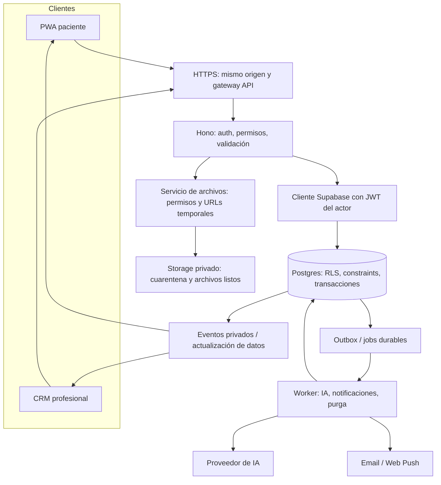

# Plan V: arquitectura propuesta para piloto y expansión

Fecha: 2026-09-16. Propuesta técnica para revisión; no autoriza migraciones ni declara aprobada la seguridad del sistema. Implementa el alcance del [plan de acción](../../plan-de-accion-2026-09-16.md).

## 1. Restricciones globales

- La aplicación activa es `plan-v/`; preservar cambios locales preexistentes.
- Primera entrega: PWA paciente y CRM web; no aplicaciones de tiendas en esta fase.
- Conservar React, TypeScript, Vite, Hono, Zod, Supabase y la identidad Plan V/Poppins.
- Fotos de comidas, estudios y fotos corporales opcionales forman parte del piloto.
- Publicación de planes, recetas y recomendaciones siempre por la nutricionista.
- Ningún dato simulado puede reemplazar silenciosamente un resultado real.
- Datos clínicos, fotos, mensajes y documentos no se guardan en localStorage ni en el cache del service worker.
- Sesiones productivas nunca pueden activar demo ni elegir un rol desde una query o control visual.
- No ejecutar los borradores SQL existentes; preparar migraciones revisadas y probarlas en un entorno descartable con datos sintéticos.
- RLS y permisos deben probarse con JWT de cada actor; service role no sirve para demostrar aislamiento.

## 2. Base actual y frontera de cambio

`App.tsx` monta AuthProvider y PlanVExperience. El diseño Nutrigo se importa únicamente en DEV; su cambio de roles y su store multipaciente sirven para demostración. La API Hono mezcla controladores, demo y repositorio Supabase en `server/index.ts` (659 líneas). `server/store.ts` tiene 1.019 líneas y constituye el almacén de memoria, no una DB. `server/db/supabase-repo.ts` concentra lectura, mapeo y escritura de dominios (585 líneas).

No hacer una reescritura general. Extraer módulos al modificar cada flujo y conservar tests de comportamiento. El diseño visual puede reutilizarse; la capacidad de simular identidad se queda en una entrada demo separada.

### Estructura de destino

Rutas siguientes son **propuestas de archivos**, no archivos que ya existan:

```text
src/
  app/                         rutas, sesión, navegación y error boundaries
  features/
    onboarding/                formularios, autoguardado, resumen de ingreso
    patient-record/            ficha profesional y vista paciente segura
    assets/                    subida, progreso, visor, retiro
    recipes/                   biblioteca y detalle
    plans/                     editor, versiones y plan paciente
    diary/                     comidas, hábitos y revisión
    messaging/                 inbox, hilo y recibos
    appointments/              agenda, confirmación y cambios
    ai-assistant/              jobs, borradores y revisión profesional
  components/nutrigo/           presentación reutilizada durante migración
  components/shared/            marca, controles, accesibilidad
  api/                         cliente tipado y manejo uniforme de errores
  store/                       sólo estado de interfaz y selección
shared/
  contracts/                   DTO públicos por rol y Zod compartido
server/
  config/runtime.ts            validación y selección explícita de modo
  http/                        auth, request ID, límites y errores
  modules/<dominio>/            rutas, servicio, repositorio y serializers
  db/                          cliente JWT, cliente administrativo y transacciones
  jobs/                        worker, outbox, reintentos y locks
  ai/                          proveedores, validación y evaluaciones
supabase/
  contracts/                   propuestas no ejecutables
  migrations/                  sólo migraciones revisadas e inmutables
  tests/                       RLS/SQL/Storage y fixtures sintéticos
tests/e2e/                     recorridos contra build de producción
```

Una sola fuente de contratos compartidos evita que el servidor importe tipos de componentes React. Separar DTO profesional/paciente y resumen/detalle: un objeto `Patient` gigante compartido no debe ser la frontera de seguridad.

## 3. Topología de ejecución



Propuesta de despliegue: frontend estático, API Node persistente y worker del mismo repositorio, más Supabase. Elegir hosting en PV-30 según región, costos y términos; no inventar que `npm run build` publica el servidor. Si se conserva Vercel como hosting frontend, se necesita proxy o adaptación explícita de Hono; el proceso `serve()` no se vuelve una función desplegada automáticamente. Un worker separado evita sostener generaciones extensas en una request HTTP.

Dominio único propuesto con `/app`, `/crm` y `/api`; entornos demo, staging y producción separados. Vite proxy es sólo desarrollo. CORS por orígenes permitidos, TLS, CSP inicial medida, `Cache-Control: no-store` en respuestas clínicas y límites de requests/cuerpo. No volcar bearer tokens, URLs firmadas o payloads clínicos en logs.

## 4. Identidad y permisos

### Modo explícito

`APP_MODE = demo | test | staging | production`. Demo usa seeds sintéticos y no proveedores reales por defecto. Staging/production requieren configuración de Auth/DB; ante ausencia o invalidez, abortar arranque/readiness. IA puede estar deshabilitada sin impedir escritura manual de registros; su estado se comunica de forma explícita. Un error de DB nunca cambia a memoria.

La app pública no crea nutricionistas por `user_metadata.role`. Crear perfiles paciente por defecto; alta profesional mediante provisión verificada. Activar MFA profesional antes del piloto y documentar recuperación/revocación. Token de invitación de alta entropía, hash persistido, expiración propuesta 72 h, uso único y aceptación transaccional ligada a email verificado; revocar/reemitir genera historial. No habilitar que una invitación vincule arbitrariamente `user_id` o cambie de nutricionista.

### Aislamiento inicial

Mantener `patients.nutritionist_id` como propietario del vínculo v1. Paciente y nutricionista se resuelven desde identidad verificada, nunca desde `from`, `role` o `nutritionist_id` enviado por cliente. Tablas hijas contienen `patient_id`; si repiten `nutritionist_id`, una FK compuesta garantiza coincidencia. Índices por propietario/paciente y fecha.

CRM no recibe la historia completa de todos los pacientes al arrancar: `PatientListItem` contiene ID, nombre, etapa, estado e indicadores agregados autorizados. Detalle sólo al abrir ficha, con paginación de mensajes/comidas/eventos. Suscripciones privadas según relación activa; un evento recibido invalida una consulta autorizada, no concede acceso.

Cliente Supabase con JWT del actor para trabajo ordinario; cliente administrativo separado y restringido a provisión, pagos, jobs y lifecycle. Al adoptar vistas/RPC, revisar grants y propietario: no convertir el borrador de vistas definer a invoker mecánicamente sin resolver sus permisos de base. [Documentación oficial de RLS](https://supabase.com/docs/guides/database/postgres/row-level-security).

### Matriz de acceso funcional

| Recurso | Paciente titular | Nutricionista vinculada | Servicio privilegiado |
| --- | --- | --- | --- |
| Datos de contacto propios | Leer/actualizar campos permitidos | Leer; corrección trazable | Invitación y vinculación |
| Intake autodeclarado | Guardar borrador, enviar y corregir con nueva revisión | Leer, marcar revisado, pedir aclaración | Versionado/auditoría |
| Notas clínicas privadas | Sin acceso | Crear/leer/editar con historial | Operaciones de retención autorizadas |
| Consentimientos | Dar/retirar y consultar propios | Ver finalidad/estado relevante | Conservar evidencia/política |
| Estudios/fotos corporales | Subir/ver propios, solicitar retiro/borrado | Leer sólo con relación y finalidad autorizadas | Escaneo/purga; no IA por defecto |
| Foto de comida | Subir/ver propia | Ver/revisar | Procesamiento de imagen autorizado |
| Recetas | Publicadas y asignadas/habilitadas | Biblioteca propia, edición y publicación | Generar borrador |
| Plan | Leer versiones publicadas propias | Crear/revisar/publicar/reemplazar | Snapshot/outbox; nunca publicar por IA |
| Mensajes | Enviar como sí mismo; leer hilo propio | Enviar como sí misma; leer hilo vinculado | Entrega y recibos |
| Recibos | Marcar propia lectura | Marcar propia lectura | Entrega confirmada por receptor |
| Hábitos/mediciones | Registrar propios | Leer, comentar por canal autorizado | Agregados/purga |
| Consulta | Leer, confirmar, solicitar/reprogramar según política | Crear/cambiar/cancelar | Conflictos, avisos |
| Brief/AI jobs | Sin acceso al borrador | Solicitar/revisar propios | Ejecutar con contexto mínimo |
| Cobros | Estado/resumen propio y comprobantes permitidos | Consultar y gestionar excepciones autorizadas | Webhook/transición auditable |
| Auditoría | Sólo exportación aplicable, no log técnico | Vista operativa acotada | Append-only y acceso restringido |

El vencimiento comercial no borra información ni bloquea indiscriminadamente solicitudes de privacidad o contacto. Definir qué sigue disponible; preservar como mínimo acceso a soporte/mensajes, estado de cuenta y solicitud de exportación/retiro. La política histórica de paywall debe revisarse con el responsable clínico/comercial.

## 5. Modelo de datos propuesto

Tablas propuestas amplían 016; no se afirma que estén creadas. UUID opacos, timestamps UTC y fecha local explícita cuando corresponda; usar `America/Argentina/Buenos_Aires` como valor inicial configurable. No almacenar “HOY”, “ayer” o “Jueves · 14:30” como fuente de verdad.

| Dominio / entidades | Campos y restricciones esenciales |
| --- | --- |
| `profiles`, `nutritionists`, `patients` | Identidad verificada; rol protegido; `user_id` único del paciente; profesional propietario; `archived_at`; no roles ni billing editables por el paciente |
| `patient_invites`, `patient_invite_events` | Hash, destino, expiración, aceptación/revocación, actor; transiciones append-only; vínculo de un uso |
| `patient_contacts` | Contacto separado de resumen clínico; nombre preferido, teléfono opcional, timezone; acceso mínimo |
| `intake_sessions` | `patient_id`, `schema_version`, `status`, `step`, `revision`, `submitted_at`, `reviewed_by/at`; un borrador vigente; JSON validado por versión |
| `patient_health_profiles` | Alergias, restricciones y antecedentes autodeclarados estructurados; estados `unknown/none/reported`; fecha/origen/revisión profesional; no confundir vacío con “sin alergias” |
| `clinical_notes` | Autor profesional, patient ID, versión, texto y timestamps; completamente separada del DTO paciente |
| `consent_events` | Finalidad, versión de texto, hash, actor, decisión, fecha, alcance; append-only, revocación como evento, nunca checkbox suelto |
| `patient_assets` | Paciente, creador, categoría `meal_photo/clinical_document/body_progress`, bucket/path opaco, MIME real, bytes, checksum, estado, consentimiento, fecha de captura opcional, `deleted_at` |
| `document_records` | Asset, tipo/fecha del estudio autodeclarados y nota del paciente; revisión profesional separada; no diagnóstico ni OCR implícito |
| `body_photo_entries`, `measurements` | Asset/medición, fecha, tipo, valor/unidad/origen y propósito autorizado; fotos opcionales, vistas frente/perfil/espalda opcionales |
| `ingredients`, `ingredient_nutrients` | Nombre normalizado, unidad base, valores y fuente/versionado; nulos cuando no hay base para cálculo |
| `recipes`, `recipe_versions`, `recipe_ingredients` | Propietario, estado, versión; yield/porciones, cantidades/unidades, pasos, tiempos, alérgenos, imagen con origen, nutrientes derivados, autor/revisor |
| `meal_plans`, `meal_plan_versions`, `meal_plan_items` | Paciente, fechas desde/hasta, timezone, estado, versión, publicación; ítems con fecha/momento, receta-version o texto libre, porciones y nota pública |
| `meal_logs`, `meal_analysis_runs`, `meal_reviews` | Registro del paciente separado de análisis/revisión; asset opcional; estimaciones y confirmados diferenciados; idempotency key y autoría |
| `habit_logs`, `activity_logs`, `goals`, `goal_history` | Fechas y valores reales, actor/origen; goal_history profesional privado; no sumar un evento editorial a adherencia |
| `conversations`, `messages`, `message_receipts` | Conversación vinculada, autor real, client message ID único, tiempo servidor; contenido inmutable con política explícita de correcciones; recibos únicos por usuario/mensaje |
| `appointments`, `appointment_events` | Inicio/fin UTC, timezone, estados, versión; no eliminar consulta previa al reprogramar; constraint transaccional de solapamiento por profesional |
| `shopping_lists`, `shopping_items`, `favorites` | Paciente y versión de plan de origen; cantidad/unidad normalizadas; overrides manuales sin sobrescribir al regenerar |
| `resources`, `resource_assignments` | Versiones editoriales, publicación, autor; asignación única y primera lectura idempotente |
| `exercise_library`, `routine_assignments` | Habilitación profesional comprobada y rutina versionada; fuera del primer piloto si no hay responsable habilitado |
| `ai_jobs`, `ai_artifacts` | Tipo, paciente, solicitante, contexto-versión/hash, modelo/prompt-versión, estado, intentos, coste/tokens, advertencias; borrador privado |
| `outbox_events`, `notification_deliveries` | ID de evento, destinatario/versión, canal, reintentos y deduplicación; payload de notificación mínimo |
| `audit_events`, `privacy_requests` | Actor, acción, recurso opaco, fecha y resultado; sin copiar texto clínico al log; retención definida por categoría |
| `payments`, `payment_webhook_events` | ID proveedor/evento único, importe/moneda inmutables y transiciones auditadas; nunca confiar en redirect de checkout para habilitar acceso |

Cambiar una receta no altera menús ya publicados: cada ítem referencia una versión inmutable. Cambiar un plan crea nueva versión y conserva lo que vio el paciente. Una semana vacía no se rellena repitiendo la actual silenciosamente.

### Contratos API iniciales

| Endpoint propuesto | Actor / efecto |
| --- | --- |
| `POST /api/invites` y `POST /api/invites/accept` | Profesional autorizado / cuenta verificada; tokens fuera de logs |
| `GET /api/me/onboarding`, `PATCH /api/me/onboarding` | Paciente; lectura/autoguardado con `expectedRevision`; 409 ante conflicto |
| `POST /api/me/onboarding/submit` | Paciente; validación y envío idempotente; emite evento para CRM |
| `POST /api/patients/:id/intake/review` | Profesional; registra revisión sin reescribir respuesta del paciente |
| `POST /api/assets/upload-intents` | Paciente autorizado; reserva ID y URL de subida temporal |
| `POST /api/assets/:id/complete` | Verifica subida; pendiente de escaneo, no listo por declaración del cliente |
| `POST /api/assets/:id/access` | Verifica relación/finalidad y emite URL de lectura corta; audita acceso |
| `POST /api/assets/:id/withdraw` | Retiro inmediato de nuevas lecturas; proceso de borrado según política |
| `GET/POST /api/recipes`, `POST /api/recipes/:id/versions` | Catálogo profesional; versiones y revisión |
| `POST /api/patients/:id/plans`, `PATCH /api/plans/:id/draft` | Profesional; borrador privado con optimistic locking |
| `POST /api/plans/:id/publish` | Sólo profesional; versión esperada + idempotencia + validaciones + transacción/outbox |
| `GET /api/me/plans?from=&to=` | Paciente; sólo snapshots publicados propios |
| `POST /api/ai/jobs`, `GET /api/ai/jobs/:id` | Profesional; 202 + job ID; no payload clínico en evento de progreso |
| `POST /api/conversations/:id/messages` | Autor se deriva del JWT; idempotencia por client message ID |
| `POST /api/messages/:id/read` | Actor receptor; marca inmutable de primera lectura |

Uniformar errores `{ code, message, requestId, fieldErrors? }`: 401 sesión; 403 relación/capacidad; 404 recurso no visible; 409 versión/conflicto; 413 tamaño; 415 tipo; 422 datos; 429 límite; 503 proveedor/servicio. Las opciones 403/404 deben aplicarse consistentemente sin revelar existencia de pacientes ajenos. El frontend no muestra el cuerpo técnico crudo de una excepción.

## 6. Fotos y documentos: circuito completo

1. Elegir categoría y verificar finalidad/consentimiento; fotos corporales jamás obligatorias para continuar.
2. Crear intención en servidor con patient ID derivado del actor; path aleatorio, no nombre/email.
3. Subir a bucket privado de cuarentena. Propuesta inicial: fotos JPG/PNG/WebP hasta 10 MB; estudios PDF/JPG/PNG hasta 20 MB. Validar en servidor, límites coherentes en cliente y Storage. Para HEIC: conversión controlada si existe soporte, o mensaje y alternativa; nunca renombrar extensión.
4. Finalizar: comprobar existencia/tamaño/magic bytes, decodificación, límites de píxeles/páginas, checksum y propiedad. Reencodificar fotos sin EXIF; escanear documentos. Evitar imágenes comprimidas que consumen memoria desproporcionada. Rechazar HTML/SVG/ejecutables y PDFs activos/peligrosos según escáner.
5. Marcar `ready` tras validación; sólo entonces referenciar en diario/ficha. Worker limpia intenciones no completadas y huérfanos.
6. Leer mediante acceso autenticado o URL firmada propuesta de 60 s; `no-store`, no URLs permanentes en DB, no miniaturas públicas. URLs firmadas pueden ser reenviadas hasta vencer: revocación no debe prometer invalidación instantánea de una URL ya emitida; para fotos corporales considerar proxy autenticado si se necesita ese requisito. [Storage privado](https://supabase.com/docs/guides/storage/buckets/fundamentals).
7. Retiro revoca nuevas lecturas. Purga incluye original, derivados, thumbnails, exports y copias gestionadas; backups siguen calendario de retención aprobado. No prometer borrado inmediato de todos los backups.

DB contiene metadatos/path; nunca base64. Estudios y fotos corporales no se mandan al proveedor de IA en v1. Fotos de comidas sólo para análisis autorizado; su fallback es registro manual. No inferir peso, grasa corporal o diagnósticos de fotografías.

## 7. IA y procesamiento en segundo plano

Ver el [flujo detallado de IA](2026-09-16-plan-v-onboarding-ia-design.md). Elegir cola durable respaldada por Postgres para el piloto, con leasing/locks, backoff, intentos máximos y dead letter; no temporizadores del proceso como única persistencia. No sumar Redis/Kafka hasta justificar volumen.

Crear registro de comida antes de procesar IA. Si el análisis falla queda `analysis_status=failed` con `macros=null`, manteniendo foto/descripción para revisión. Job de menú se ejecuta contra una versión concreta de intake y restricciones; un cambio de alergia invalida el borrador anterior para publicación. Comprobar permisos de nuevo al ejecutar y publicar, porque pueden haberse revocado durante la cola.

Outbox transaccional para publicación/envío: guardar cambio y evento en una transacción. Reintentos pueden ocurrir más de una vez; consumidores idempotentes. Notificación no contiene diagnóstico, medidas ni fotografías. Registrar coste por job y límite por profesional/mes sin exponer datos clínicos a analítica.

## 8. PWA y estado frontend

Manifest con nombre/iconos/start URL/scope coherentes, modo standalone, HTTPS e instalación verificada en Android y iPhone. Los mecanismos de instalación varían por navegador: no mostrar instrucciones de Android a Safari. [MDN: instalación de PWA](https://developer.mozilla.org/en-US/docs/Web/Progressive_web_apps/Guides/Making_PWAs_installable).

Service worker cachea solamente shell y assets públicos de marca. `/api`, Supabase, archivos privados y URLs firmadas fuera del cache. Primer piloto requiere conexión para guardar; offline muestra “Todavía no se guardó” y conserva edición en memoria sólo mientras sigue abierta. No anunciar offline completo ni cerrar una pantalla con éxito antes del ACK servidor.

Permiso de push después de explicar su utilidad y con acción del usuario; rechazo no bloquea atención. Instalar PWA y habilitar push son decisiones distintas. Push remoto necesita service worker, suscripciones, backend y delivery; el `Notification` actual con página abierta no lo sustituye.

Estado remoto con claves que incluyen usuario/paciente, paginación y cancelación. Zustand permanece para interfaz, tema y selección. Puede incorporarse librería de queries si simplifica la migración; no hacerla una condición para empezar. Logout, expiración y cambio de cuenta borran cache en memoria y cierran suscripciones; ninguna respuesta tardía de la sesión previa repuebla el store.

## 9. Operación, datos personales y criterios de salida

Definir con responsable de privacidad: finalidad/base aplicable por dato, texto de información, contratos de proveedores, país/región, derechos, retención, transferencias y procedimiento de incidentes. No se formula aquí un dictamen legal ni se inventan plazos legales. El consentimiento para fotos corporales es granular y opcional; retirar no elimina notas profesionales que deban conservarse por una obligación documentada.

Separar almacenamiento de estudios/fotos de analítica. Sin herramientas de grabación de sesión en pantallas clínicas. Logs con request ID, actor pseudónimo, acción/código/duración y recurso opaco; ni nombres, prompts completos o mensajes. Exportar mediante job y enlace temporal autenticado; verificar identidad sin pedir datos excesivos.

Backups DB y Storage con inventario enlazado y restauración ensayada. Objetivos iniciales propuestos del piloto: RPO ≤24 h, RTO ≤8 h, sin compromiso comercial hasta medir. Borrado lógico inmediato de acceso; purga física y backups conforme a política aprobada. Versiones publicadas y auditoría append-only; rollback de aplicación no destruye información nueva.

Alertas de errores de auth/DB, cola atrasada, fallos de upload, pérdida de envío y coste IA. Registrar un responsable de operación y un canal de soporte; la mensajería del consultorio debe declarar su ventana de respuesta, no prometer disponibilidad urgente 24/7.

### Matriz de validación

| Nivel | Evidencia requerida |
| --- | --- |
| Unidad | Transiciones, validación de ingredientes/unidades, DTO por allowlist, fechas y límites |
| API | JWT real/sintético verificado, relaciones, errores, idempotencia, conflictos y payload paciente sin campos privados |
| DB/RLS | Nutri A/B, Paciente A/B, invitación expirada, usuario sin vínculo, revocación, raw tables/vistas/RPC; CRUD negativos sin service role |
| Storage | A no sube/lee/borra asset de B; falsificación de MIME, exceso de tamaño/píxeles, URL vencida, revocación, purga y huérfanos |
| E2E build | Invitación→ingreso→ficha; receta/IA→revisión→publicación; foto→revisión; mensajes entre dos sesiones; recuperación y pago si aplica |
| Visual / accesibilidad | 1440/800/390/320, claro/oscuro, teclado, foco, lectores de pantalla, zoom 200%, reduced-motion; comparación con referencia local |
| Resiliencia | DB/proveedor caído, red interrumpida, reenvío, duplicados, respuestas fuera de orden, job duplicado, cierre de sesión y reinstalación PWA |
| Operación | Restauración DB+objetos, retiro/exportación, rollback compatible, logs redactados, costo IA y checklist de soporte |

Modificar nombres de tests no basta: deben demostrar comportamientos desde ambos roles. La suite actual es una base de regresión; el piloto exige estas capas adicionales.
