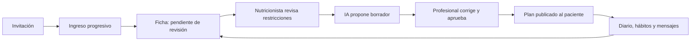

# Plan V: onboarding, experiencia profesional e IA

Fecha: 2026-09-16. Especificación propuesta; las pantallas y capacidades descritas aquí aún deben implementarse. Vinculada al [plan de acción](../../plan-de-accion-2026-09-16.md) y a la [arquitectura](2026-09-16-plan-v-arquitectura-design.md).

## 1. Experiencia que debe quedar completa

El paciente llega por invitación de su nutricionista, entiende qué información comparte, completa lo necesario en pequeños pasos y puede retomarlo. La profesional recibe un ingreso ordenado, revisa datos y restricciones, prepara un plan con ayuda de IA y lo publica. El paciente ve instrucciones claras, recetas utilizables y un canal humano para conversar. Cada pantalla tiene un resultado en el otro rol.

Recorrido:



## 2. Onboarding: alcance y datos

El onboarding actual tiene seis pantallas demo y no guarda la información completa. Reutilizar marca y primitives, reemplazar estado efímero por `intake_sessions` y dividir los contenidos por objetivo. No convertirlo en un formulario largo con animación decorativa.

Objetivo de diseño a medir: completar el ingreso esencial en 5–8 minutos, con módulos opcionales que se pueden continuar después. El tiempo es una meta de usabilidad, no un resultado medido. Mostrar “Paso 3 de 8” por bloques, y cantidad variable de subpantallas según respuestas.

| Bloque / pantalla | Información y regla | Experiencia / copy orientativo | Eco profesional |
| --- | --- | --- | --- |
| 0. Invitación y acceso | Token válido, profesional real, cuenta/email verificado; link vencido tiene recuperación | “Verónica te invitó a Plan V. Un espacio para acompañarte entre consultas.” | Estado invitado/aceptado; no cuenta vinculada por nombre libre |
| 1. Bienvenida | Explicar plan, registro y mensajes; no campos clínicos | Tres beneficios breves, foto/avatar autorizado de la profesional y botón “Empezar” | Se registra inicio del ingreso |
| 2. Privacidad y decisiones | Información de privacidad versionada; consentimiento/base de atención según revisión; permiso separado para imágenes corporales y procesamiento IA de fotos de comida | “Vos elegís qué compartir. Las fotos corporales son opcionales.” Enlaces legibles a detalles | Evidencia por finalidad, fecha y versión; rechazo opcional no bloquea atención manual |
| 3. Sobre vos | Nombre/preferido; email verificado; teléfono opcional; fecha de nacimiento si se valida necesidad/edad; timezone detectada con confirmación | Una o dos preguntas por vista. Autocomplete y teclado correctos | Datos autodeclarados; nunca cambia ownership ni rol |
| 4. Qué querés trabajar | Motivo de consulta y objetivo expresado por paciente; dificultades y expectativas; texto breve opcional | “¿En qué te gustaría que te acompañemos?” Opciones más “Contame con tus palabras” | Separar intención del paciente de objetivo/indicación profesional |
| 5a. Alergias y restricciones | Opciones explícitas “No tengo”, “Sí” y “No lo sé”; alimentos, reacción reportada, restricciones culturales/éticas; sin lista diagnóstica automática | “¿Hay alimentos que necesitás evitar?” Campo libre complementa catálogo | Banner “Por revisar”; una respuesta vacía nunca equivale a ausencia |
| 5b. Antecedentes relevantes | Condiciones conocidas por el paciente, medicamentos/suplementos, síntomas relevantes y embarazo/lactancia sólo cuando corresponda a la atención | Se permite “Prefiero conversarlo en consulta”; formulario adaptativo | La profesional valida, corrige mediante nota separada y decide si generar menú |
| 6a. Rutina y preferencias | Horarios, trabajo/turnos, cocina/equipamiento, tiempo disponible, acceso a alimentos, presupuesto en rangos opcionales, gustos/aversión y convivencia | Tarjetas seleccionables y texto libre; no slider ambiguo para horarios | Restricciones prácticas para el plan, distintas de restricciones clínicas |
| 6b. Hábitos iniciales | Hidratación con unidad, sueño, actividad, energía; permitir no responder; distinguir valor cero de desconocido | “Podés completarlo ahora o volver después.” Sin metas genéricas impuestas | Datos con fecha/origen; no mezclar un intake habitual con registro de “hoy” |
| 7a. Peso y medidas opcionales | Peso, altura/otras medidas acordadas, unidad y fecha; “No lo sé”/“Prefiero no cargarlo” | Campos numéricos sin metas, juicios ni puntajes de cuerpo | Serie temporal de valores declarados; profesional verifica si son útiles |
| 7b. Estudios opcionales | PDF/JPG/PNG; tipo y fecha opcionales; estado de subida/validación; acceso después del ingreso | “Si tenés estudios que quieras compartir, podés agregarlos acá.” Sin pedir estudios nuevos | Bandeja de documentos por revisar, original y metadatos; no interpretación automática |
| 7c. Fotos corporales opcionales | Consentimiento específico, cámara/galería, fecha, vista opcional; omitir con la misma facilidad | “Sólo si te resulta cómodo. Podés seguir sin fotos.” No pedir desnudez; orientación opcional de iluminación/encuadre con ropa | Sección separada y privada; sin miniaturas en listados generales, emails ni notificaciones |
| 8. Revisar y enviar | Resumen editable; distinguir obligatorios, desconocidos, omitidos y uploads aún en proceso | “Revisá lo que vas a compartir.” CTA “Enviar a mi nutricionista” | Crea una revisión de intake y evento idempotente; lista de faltantes útiles |
| 9. Recibido | Confirmación real del servidor, estado “Verónica va a revisarlo”, próxima acción según exista plan | “Recibimos tu información.” Acceso a mensajes y diario; no fingir plan listo | Badge de ingreso pendiente y acceso directo a revisar |

Los bloques se ramifican; no obligar a recorrer 14 pantallas si las respuestas permiten omitir módulos. Edad, campos clínicos exactos y copy final se revisan con Verónica antes del piloto. Si aparece un menor en el piloto adulto propuesto, pausar alta y derivar a soporte: no aceptar un checkbox como tutoría verificada.

### Guardado y estados

`invited → started → in_progress → submitted → under_review → completed`, con `needs_clarification` cuando la profesional pide aclaración. Archivar relación y revocar consentimiento son estados independientes del intake.

- Autoguardar en servidor al salir del campo/paso y después de 800 ms de inactividad; debounce no es garantía de persistencia.
- Indicador accesible “Guardando / Guardado / No pudimos guardar”. Botón de continuar espera el guardado válido del paso.
- Guardar `schema_version`, `revision` y `current_step`; PATCH usa `expectedRevision`; 409 muestra recuperación sin sobrescribir otra sesión.
- Al reabrir desde otro dispositivo, continuar desde último paso confirmado. Draft clínico no se guarda en localStorage.
- Submit idempotente: doble click o reintento devuelve la misma revisión y no duplica avisos.
- Formularios enviados se corrigen creando revisión o registro de cambios; observaciones de la nutricionista no reescriben declaraciones históricas del paciente.
- Archivos en cuarentena muestran “Procesando”; su falla no borra los datos escritos. Campos opcionales se pueden omitir y completar luego.
- No usar casillas preseleccionadas para permisos opcionales. Enlaces de retiro/exportación siguen accesibles después del ingreso.

## 3. Dirección visual y movimiento

Mantener Poppins local, logo y paleta Plan V (`#083A30`, `#23955D`, `#F9B343`, `#F9F6EE` y acentos existentes). Usar el sistema Nutrigo para componentes, espaciado y responsive. El onboarding es una superficie propia: no hay evidencia de que el pack contenga este flujo clínico.

Diseño propuesto: fondo crema, una tarjeta central de contenido con título claro y pocas decisiones, progreso visible y acciones consistentes. En escritorio, composición de dos columnas: contexto de la profesional y formulario; en celular, una columna y acciones inferiores que no tapen teclado ni campos. Fotos e ilustraciones de marca sólo si tienen origen/licencia registrada; nunca fotos de pacientes decorativas.

Pautas medibles: texto de formulario 16 px, títulos 26–34 px según ancho, controles ≥44×44 px, contraste AA, labels persistentes, estados seleccionados distinguibles sin depender sólo del color. Anchos de QA 320/390/800/1440, zoom 200%, claro/oscuro. Reservar área de mensajes de error para evitar saltos.

| Interacción | Animación propuesta | Comportamiento accesible |
| --- | --- | --- |
| Cambio de paso | Opacidad + desplazamiento 12 px, 180–220 ms; hacia adelante/atrás coherente | Al terminar, foco en título o primer error; conservar scroll útil |
| Progreso | Ancho/transform suave de 180 ms | Texto “Paso X de Y” y región de estado; no depender de puntos sin etiqueta |
| Selección | Borde/fondo 120–160 ms y check sutil | `aria-pressed`/radio nativo, teclado y foco visible |
| Validación | Mensaje junto al campo y resumen cuando se intenta avanzar | Sin sacudidas, pulsaciones o invalidación durante cada tecla |
| Subida | Progreso real; placeholder con dimensiones fijas | Texto de porcentaje/estado; cancelar/reintentar; no avance inventado |
| Finalización | Check de 240–300 ms, una sola vez | Mensaje anunciado; sin confeti ni celebración ligada al peso |
| Movimiento reducido | Suprimir desplazamiento y animaciones no esenciales | Respetar `prefers-reduced-motion`; navegación instantánea o transición de opacidad mínima |

Implementar CSS para estas transiciones; una librería de animación sólo si aparece necesidad concreta. No animar layout continuamente ni encadenar animaciones que retrasen respuestas. Verificación manual con teclado/lector más tests de navegación real; render estático no prueba foco ni autoguardado.

### Estados que tienen diseño propio

Invitación vencida/revocada/usada; sesión expirada; sin conexión; error de guardado; conflicto de edición; permiso de cámara rechazado; archivo demasiado grande/no soportado; archivo procesándose/rechazado; no hay plan publicado; alta enviada y pendiente de revisión. Cada estado tiene una próxima acción, conserva datos donde corresponde y no muestra errores técnicos.

## 4. Ficha profesional y operación diaria

Agregar una bandeja “Ingresos por revisar” al Centro de seguimiento. Cada ítem muestra estado, fecha, información pendiente y número de documentos; no hace ranking clínico automático.

Ficha por paciente: Resumen / Ingreso / Diario / Planes / Documentos / Evolución / Mensajes / Consultas. Adaptar las entradas existentes sin duplicar fichas. En ingreso, mostrar origen “Paciente” y revisión profesional; notas privadas aparte. Estudios y fotos corporales requieren entrada deliberada al visor, no un collage visible al cambiar de paciente.

Acciones principales: revisar ingreso; pedir aclaración por mensaje; revisar comida; editar plan; generar propuesta; publicar; coordinar consulta. El paciente ve únicamente el resultado publicado o mensaje enviado, nunca un comentario profesional en borrador.

## 5. IA: tres capacidades separadas

### A. Análisis de comida

Entrada: asset de comida autorizado o descripción, momento y referencia del plan si existe. Salida: alimentos/porciones estimados, macros opcionales, incertidumbre y nota profesional. Conservar el registro aunque no haya análisis. Paciente ve “Estimación pendiente de revisión”; la nutricionista confirma/corrige y queda autor/fecha. Cambiar el actual fallback a comida ficticia ante errores.

### B. Borrador de receta y menú

Entrada elegida por la profesional:

- Paciente y versión de ingreso revisado.
- Semana/fechas, comidas deseadas y objetivo profesional.
- Restricciones/alergias validadas y preferencias.
- Tiempo de cocina, equipamiento, disponibilidad y presupuesto opcional.
- Catálogo propio de recetas aprobadas, ingredientes y porciones.
- Objetivos nutricionales sólo cuando los define la profesional, no inferidos del peso o una foto.

“Generar propuesta” abre una configuración pequeña; después trabaja en segundo plano y aparece en la bandeja del CRM. No necesita un chat generalista. Se puede seguir usando la ficha durante el job.

Estados: `queued → running → needs_review | failed | cancelled`. Reintentos limitados e idempotentes; contexto cambiante produce `stale`, que obliga a regenerar o revisar las diferencias. Cancelación evita publicar resultados tardíos.

Salida estructurada propuesta:

```ts
type MenuProposal = {
  schemaVersion: 1;
  patientId: string;
  intakeRevision: number;
  startDate: string;
  endDate: string;
  days: Array<{
    date: string;
    meals: Array<{
      slot: 'desayuno' | 'colacion' | 'almuerzo' | 'merienda' | 'cena' | 'extra';
      recipeVersionId: string | null;
      draftRecipeId: string | null;
      servings: number;
      patientNote: string | null;
    }>;
  }>;
  draftRecipes: Array<{
    id: string;
    title: string;
    servings: number;
    ingredients: Array<{
      ingredientId: string | null;
      name: string;
      quantity: number;
      unit: 'g' | 'ml' | 'u';
    }>;
    steps: string[];
    preparationMinutes: number;
    cookingMinutes: number;
    allergenCandidates: string[];
  }>;
  warnings: string[];
};
```

Los IDs del ejemplo son referencias internas, no autoridad del modelo: el servidor revalida que existan, pertenezcan al catálogo permitido y coincidan con el contexto. Exactamente una referencia de receta por comida; fechas completas y únicas en el rango; porciones/cantidades positivas; ingredientes desconocidos bloquean cálculo nutricional/publicación hasta revisión. Recomendación inicial: rangos plausibles se acuerdan con la nutricionista y se codifican fuera del prompt.

El modelo propone texto y estructura. Totales nutricionales se calculan con ingredientes, cantidades, rendimiento y una fuente elegida y versionada. No usar cifras generadas por texto como base oficial de macros ni asumir conversión g↔ml sin densidad. Si falta dato se muestra “Sin calcular”; no cero. No prometer que una receta está libre de alérgenos sólo por inferencia del modelo.

Flujo profesional:

1. Revisar advertencias y restricciones; bloquear generación/publicación si alergias están desconocidas o una revisión clínica requerida falta, según regla aprobada por Verónica.
2. Ver menú por día y recetas, origen IA y diferencias frente al plan vigente.
3. Editar plato/ingrediente/porción; regenerar sólo una comida preserva el resto y mantiene historial.
4. Validación determinista de ownership, alérgenos normalizados, ingredientes, unidades, datos faltantes, fechas y versión.
5. Aprobación explícita de la profesional. Publicación transaccional de receta/plan como snapshot; outbox notifica al paciente.
6. El paciente ve el plan y recetas aprobados. Una edición posterior sigue siendo borrador hasta otra publicación.

`ready_for_review` nunca equivale a `published`. El worker no tiene permiso para publicar planes ni enviar mensajes en nombre de la profesional. Revalidar alergias y versión justo al publicar, no únicamente al generar.

### C. Resumen y próxima acción

Evolucionar el brief existente para resumir eventos trazables: ingreso nuevo, comidas pendientes, mensaje sin responder, cambio de plan o consulta. Incluir referencias a fuentes autorizadas y fecha; si faltan datos, explicarlo. No interpretar que falta de registro demuestra incumplimiento ni convertir lectura de artículo en adherencia.

La profesional decide si envía un borrador de mensaje, cambia menú o agenda. El paciente conversa con la nutricionista; no se agrega automáticamente un chatbot clínico.

## 6. Privacidad y límites de IA

Contexto mínimo con identificador opaco, preferencias y restricciones necesarias. No mandar nombre, email, teléfono, documentos completos ni fotos corporales. Las notas libres del paciente, textos de recetas y contenido de archivos son datos no confiables: no pueden cambiar instrucciones, solicitar herramientas o provocar envíos/lecturas de otros pacientes.

Seleccionar proveedor/modelo mediante evaluación; conservar integración actual como adaptador sin congelar para siempre `gpt-4o-mini`. Validar contrato de procesamiento/retención y configuración real antes de datos personales. No afirmar “no entrena” sólo porque el prompt lo diga. Configurar presupuesto, límite de tokens, timeout y cola máxima por profesional.

Logs técnicos guardan estado, versión/hash de contexto y métricas; el artefacto clínico va en almacenamiento protegido. No copiar prompts clínicos a herramientas generales de observabilidad. Estudios y fotos corporales tienen análisis exclusivamente humano en v1.

### Evaluación antes del piloto

Conjunto inicial propuesto: 30 escenarios sintéticos versionados, revisados por Verónica; al menos 5 de alergias/restricciones, 5 de faltantes/unidades, 5 de preferencias/tiempos, 5 de modificaciones concurrentes, 5 de errores/reintentos y 5 de privacidad/instrucciones maliciosas.

Puertas obligatorias: ningún borrador se publica sin acción humana; todos los intentos de acceso cruzado fallan; ninguna alergia explícita del set pasa inadvertida por el validador; una caída de IA nunca devuelve un mock; una revisión desactualizada bloquea publicación. El éxito del set no demuestra seguridad clínica universal: la revisión profesional sigue siendo parte del producto.

Medir utilidad con tiempo de preparación de un plan, proporción de sugerencias editadas/descartadas y costo por plan aprobado. Acordar objetivos después de una semana de uso sintético; no asignar un “health score” a la persona.

## 7. Aceptación conjunta

- Un paciente puede omitir fotos corporales, peso y estudios y terminar el ingreso sin presión ni bloqueo innecesario.
- La información aceptada por servidor reaparece tras cerrar sesión o cambiar dispositivo.
- La nutricionista recibe datos, consentimiento y documentos del mismo paciente; otra profesional no accede ni por URL/API.
- La UI muestra pendientes y fallos reales; nunca “Listo” por avanzar de pantalla sin escritura.
- Las animaciones no impiden teclado, lector de pantalla ni movimiento reducido.
- Un borrador de menú con IA sólo llega al paciente después de revisión/publicación profesional.
- La lista de compras coincide con ingredientes/porciones de la versión publicada, sin cantidades inventadas.
- Una nota privada o borrador nunca aparece en HTML, JSON, cache, notificación, exportación no autorizada ni payload de eventos del paciente.

## 8. Preguntas de producto que se resuelven al comenzar

Responsables y decisiones, sin asumir aprobación: Verónica valida campos/alertas clínicas y ventana de respuesta; producto confirma población adulta, países y modalidad de cobro; privacidad define textos/retención/proveedores; UX presenta una comparación real de bienvenida, restricciones y documentos antes de dar por aprobado el onboarding visual. Estas decisiones se registran con fecha y versión y no requieren volver a diseñar la arquitectura completa.
